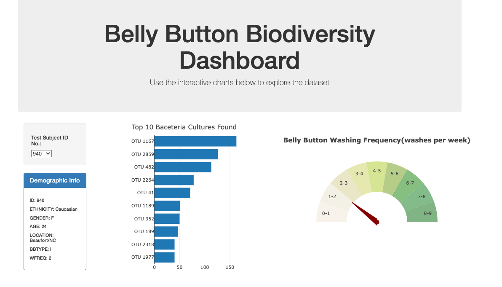
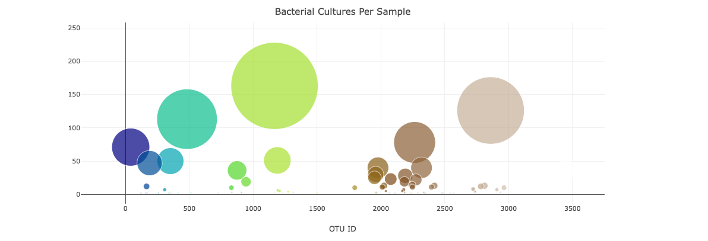

# Belly Button Bacteria Dashboard

This project uses plotly to create dynamic visualizations that explore microbes that colonize human navels. 

The original data source and study is located here: http://robdunnlab.com/projects/belly-button-biodiversity/results-and-data/

In this repo the dataset is located as a json file, populated by the above data.

# Samples Dashboard

The dashboard has been deployed to Github pages. In this dashboard a user can select a test subject ID and then see the associated Demographic info, top 10 bacteral found, and the number of bacteria bacteria cultures per sample.

The github page can be found here: https://erickadame.github.io/belly-button-challenge/

